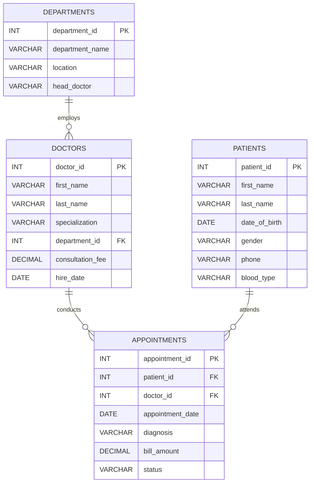

# ER Diagram — Hospital Management System

## Relationship Explanations

| Relationship | Type | Meaning |
|---|---|---|
| DEPARTMENTS → DOCTORS | One-to-Many | One department employs many doctors |
| DOCTORS → APPOINTMENTS | One-to-Many | One doctor conducts many appointments |
| PATIENTS → APPOINTMENTS | One-to-Many | One patient attends many appointments |

The APPOINTMENTS table is the central fact table linking patients and doctors.
