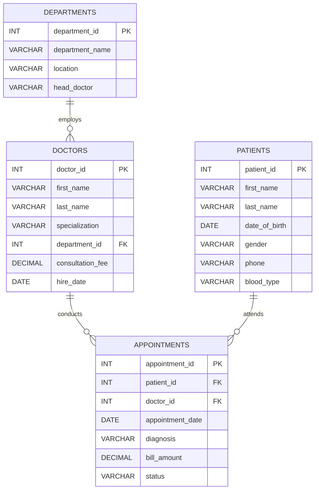

# Hospital Management System
### Database Programming Assignment 1

---

## Table of Contents
1. [Business Problem](#business-problem)
2. [Objectives](#objectives)
3. [Technologies Used](#technologies-used)
4. [Database Schema](#database-schema)
5. [ER Diagram](#er-diagram)
6. [CTE Implementations](#cte-implementations)
7. [Window Function Implementations](#window-function-implementations)
8. [Analysis and Findings](#analysis-and-findings)
9. [Repository Structure](#repository-structure)
10. [References](#references)
---

## Business Problem

City General Hospital manages hundreds of patient appointments daily across six departments. Without structured data analysis, the administration cannot:

- Identify which doctors generate the most revenue
- Track patient spending patterns over time
- Detect monthly revenue trends for budget forecasting
- Understand the management reporting hierarchy

This project builds a relational database and applies advanced SQL techniques to answer these business questions.

---

## Objectives

| # | Objective |
|---|-----------|
| 1 | Design a normalized relational database for a hospital |
| 2 | Implement Common Table Expressions (CTEs) for readable, layered queries |
| 3 | Apply SQL Window Functions for ranking, trend, and distribution analysis |
| 4 | Produce actionable business insights from the data |
| 5 | Document the project professionally for GitHub publication |

---

## Technologies Used

| Technology | Version | Purpose |
|---|---|---|
| MySQL | 8.0+ | Database engine |
| MySQL Workbench | 8.0 | Query execution and schema design |
| Mermaid | GitHub-native | ER diagram rendering |
| Markdown | GitHub-native | Documentation |

---

## Database Schema

### Table: `departments`
| Column | Type | Constraint | Description |
|---|---|---|---|
| department_id | INT | PRIMARY KEY, AUTO_INCREMENT | Unique department identifier |
| department_name | VARCHAR(100) | NOT NULL, UNIQUE | Name of the department |
| location | VARCHAR(100) | NOT NULL | Physical location in hospital |
| head_doctor | VARCHAR(100) | NOT NULL | Name of department head |

### Table: `doctors`
| Column | Type | Constraint | Description |
|---|---|---|---|
| doctor_id | INT | PRIMARY KEY, AUTO_INCREMENT | Unique doctor identifier |
| first_name | VARCHAR(50) | NOT NULL | Doctor's first name |
| last_name | VARCHAR(50) | NOT NULL | Doctor's last name |
| specialization | VARCHAR(100) | NOT NULL | Medical specialization |
| department_id | INT | FOREIGN KEY → departments | Department the doctor belongs to |
| consultation_fee | DECIMAL(8,2) | NOT NULL | Standard consultation fee |
| hire_date | DATE | NOT NULL | Date doctor was hired |

### Table: `patients`
| Column | Type | Constraint | Description |
|---|---|---|---|
| patient_id | INT | PRIMARY KEY, AUTO_INCREMENT | Unique patient identifier |
| first_name | VARCHAR(50) | NOT NULL | Patient's first name |
| last_name | VARCHAR(50) | NOT NULL | Patient's last name |
| date_of_birth | DATE | NOT NULL | Patient's date of birth |
| gender | ENUM | NOT NULL | Male / Female / Other |
| phone | VARCHAR(20) | NOT NULL | Contact number |
| blood_type | VARCHAR(5) | NOT NULL | Patient's blood type |

### Table: `appointments`
| Column | Type | Constraint | Description |
|---|---|---|---|
| appointment_id | INT | PRIMARY KEY, AUTO_INCREMENT | Unique appointment identifier |
| patient_id | INT | FOREIGN KEY → patients | Patient who attended |
| doctor_id | INT | FOREIGN KEY → doctors | Doctor who conducted the visit |
| appointment_date | DATE | NOT NULL | Date of appointment |
| diagnosis | VARCHAR(200) | NOT NULL | Diagnosis recorded |
| bill_amount | DECIMAL(10,2) | NOT NULL | Amount billed |
| status | ENUM | DEFAULT 'Completed' | Completed / Cancelled / No-Show |

---

## ER Diagram



---

## CTE Implementations

### CTE 1 — Simple CTE: High-Value Patients
Identifies patients whose total completed appointment spending exceeds $500. The CTE pre-aggregates spending per patient; the outer query joins to retrieve patient names.

**Screenshot:** `Screenshots/cte1.png`

---

### CTE 2 — Multiple CTEs: Above-Average Doctors
Chains two CTEs: the first computes per-doctor revenue totals, the second computes hospital-wide averages. The final query finds doctors who exceed both the average revenue and average visit count.

**Screenshot:** `Screenshots/cte2.png`

---

### CTE 3 — Recursive CTE: Staff Hierarchy
Traverses the hospital's management structure from the Chief Medical Officer down to individual doctors using a recursive self-join. Produces an indented org chart with hierarchy depth levels.

**Screenshot:** `Screenshots/cte3.png`

---

### CTE 4 — CTE with Aggregation: Monthly Revenue Trend
Groups completed appointments by year-month and applies SUM, COUNT, AVG, MAX, MIN. Flags the best-performing month using a CASE expression referencing the CTE in a subquery.

**Screenshot:** `Screenshots/cte4.png`

---

### CTE 5 — CTE with JOIN: Doctor Revenue Share by Department
Uses two chained CTEs to compute per-doctor and per-department revenue, then joins with doctors and departments tables to show each doctor's percentage share of their department's total revenue.

**Screenshot:** `Screenshots/cte5.png`

---

## Window Function Implementations

### Ranking Functions

| Function | Query Purpose | Screenshot |
|---|---|---|
| `ROW_NUMBER()` | Unique sequential rank of appointments per doctor by bill amount | `Screenshots/wf_row_number.png` |
| `RANK()` | Rank all doctors by total revenue (ties share rank, gaps exist) | `Screenshots/wf_rank.png` |
| `DENSE_RANK()` | Rank doctors within their department (no gaps in ranking) | `Screenshots/wf_dense_rank.png` |
| `PERCENT_RANK()` | Each doctor's revenue percentile position (0–100%) | `Screenshots/wf_percent_rank.png` |

### Aggregate Window Functions

| Function | Query Purpose | Screenshot |
|---|---|---|
| `SUM() OVER()` | Running cumulative revenue total ordered by appointment date | `Screenshots/wf_sum.png` |
| `AVG() OVER()` | Each appointment's bill compared to that doctor's average | `Screenshots/wf_avg.png` |
| `MIN() / MAX() OVER()` | Department billing floor and ceiling attached to every row | `Screenshots/wf_min_max.png` |

### Navigation Functions

| Function | Query Purpose | Screenshot |
|---|---|---|
| `LAG()` | Compare each patient's bill to their previous appointment | `Screenshots/wf_lag.png` |
| `LEAD()` | Preview each patient's next appointment date and bill | `Screenshots/wf_lead.png` |

### Distribution Functions

| Function | Query Purpose | Screenshot |
|---|---|---|
| `NTILE(4)` | Divide doctors into four revenue quartiles | `Screenshots/wf_ntile.png` |
| `CUME_DIST()` | Cumulative percentage distribution of all bill amounts | `Screenshots/wf_cume_dist.png` |

---

## Analysis and Findings

### Descriptive Analysis — What Happened?

- **40 appointments** were recorded across January–May 2024 across 12 doctors in 6 departments.
- **May 2024** was the highest-revenue month at approximately **$2,310**, driven by 8 completed appointments.
- **Oncology** generated the highest per-appointment bills, with individual charges reaching **$450**.
- **3 appointments** were cancelled and **2 were no-shows**, representing a **12.5% non-completion rate**.
- Patients **Alice Thompson** and **Maria Johansson** were among the highest spenders, each visiting multiple times.

### Diagnostic Analysis — Why Did It Happen?

- Oncology's high billing reflects the complexity and cost of cancer treatment consultations.
- May's revenue peak correlates with more appointments scheduled (8 vs. 6–7 in earlier months), suggesting seasonal demand or improved scheduling efficiency.
- The no-show and cancellation rate is concentrated in Orthopedics and General Medicine, which may indicate longer wait times or lower patient urgency in those departments.
- Doctors James Hartwell (Cardiology) and Linda Nguyen (Oncology) consistently appear in the top revenue quartile, reflecting both high consultation fees and patient demand for their specializations.

### Prescriptive Analysis — Recommended Actions

| Finding | Recommended Action |
|---|---|
| 12.5% non-completion rate | Implement SMS appointment reminders 24 hours before visits |
| Oncology and Cardiology drive disproportionate revenue | Prioritize staffing and equipment investment in these departments |
| Bottom revenue quartile doctors | Assign mentoring from top-quartile peers; review scheduling allocation |
| May revenue peak | Pre-plan staffing increases for May each year based on historical demand |
| Patients with rising bill trends | Flag for proactive care management to prevent costly emergency visits |

---

## Repository Structure

```
database_programming_assignment1_studentID_firstname/
│
├── SQL/
│   ├── create_database.sql       ← Schema: tables, keys, constraints
│   ├── insert_data.sql           ← 40 realistic sample records
│   ├── cte_queries.sql           ← 5 CTE implementations
│   └── window_functions.sql      ← 11 Window Function queries
│
├── ER_Diagram/
│   └── er_diagram.md             ← Mermaid ER diagram + relationship notes
│
├── Screenshots/
│   ├── cte1.png                  ← Simple CTE output
│   ├── cte2.png                  ← Multiple CTEs output
│   ├── cte3.png                  ← Recursive CTE output
│   ├── cte4.png                  ← Aggregation CTE output
│   ├── cte5.png                  ← CTE with JOIN output
│   ├── wf_row_number.png
│   ├── wf_rank.png
│   ├── wf_dense_rank.png
│   ├── wf_percent_rank.png
│   ├── wf_sum.png
│   ├── wf_avg.png
│   ├── wf_min_max.png
│   ├── wf_lag.png
│   ├── wf_lead.png
│   ├── wf_ntile.png
│   └── wf_cume_dist.png
│
└── README.md                     ← This file
```
## References

- Silberschatz, A., Korth, H. F., & Sudarshan, S. (2020). *Database System Concepts* (7th ed.). McGraw-Hill.
- MySQL Documentation. (2024). *WITH (Common Table Expressions)*. https://dev.mysql.com/doc/refman/8.0/en/with.html
- MySQL Documentation. (2024). *Window Functions*. https://dev.mysql.com/doc/refman/8.0/en/window-functions.html
- Forta, B. (2020). *MySQL Crash Course* (2nd ed.). Sams Publishing.
- Winand, M. (2015). *SQL Performance Explained*. Markus Winand.
